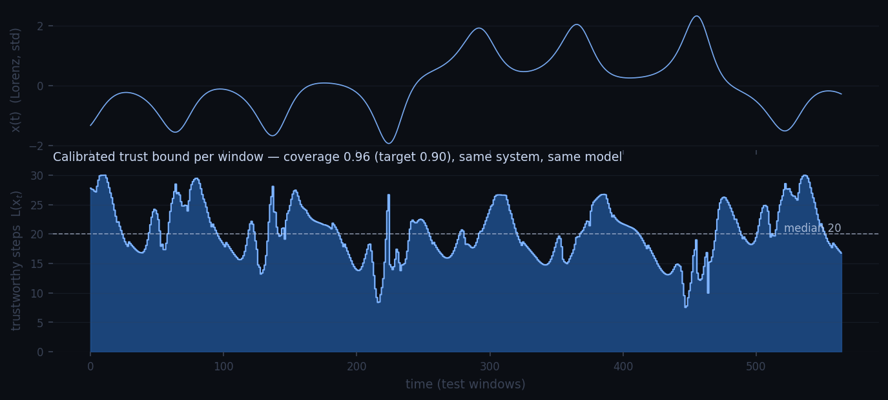

<div align="center">


# ARSAC Horizon

### The measured edge of predictability

**Before spending anything more on forecasting, know what you are fighting — noise,
cycles, or chaos — how far your forecasts can be trusted, and whether a better model
can do better. Measured, calibrated, on your data.**

[](tests/)
[](pyproject.toml)
[](pyproject.toml)
[](docs/THEORY.md)
[](docs/theory/data/)

</div>

---

Every forecasting team eventually hits a wall and asks the same three questions:
*how far can I actually trust this? is it worth improving the model? or is the rest
just noise?* The standard toolbox answers none of them — it only compares models to
other models. ARSAC Horizon answers them against an **absolute referent**: the
physical predictability limit of the data itself, which this repository measures,
rather than assumes.

## Headline results

- **A learned forecaster was driven to the physical predictability floor of the
  Lorenz system and this was proven, not claimed** — paired-twin protocol against
  the true perturbed dynamics, pre-registered criteria, replicated on two seeds:
  ρ = H_model/H_floor = **0.83 / 0.86** (threshold 0.8), error growth at
  **1.15–1.21×** the Lyapunov rate (floor control: 0.96–1.03), **18–19 Lyapunov
  times** of valid forecast. [`docs/theory/chaos_floor.md`](docs/theory/chaos_floor.md)
- **A quantitative floor law, derived then verified across two systems and three
  regimes** (model-error injection, observation noise, one-shot perturbation):
  `H ≈ ln(τ/ε)/(λ₁·dt)`, measured-to-theory ratios **0.88–1.21** everywhere tested.
- **A predictability-regime classifier pinned on six canonical signal types** —
  including the traps: the random walk that fools Lyapunov estimators with diffusive
  divergence, and the ICU biosignal that exposed a real failure of our own diagnostic
  (see *Why the profiler exists*, below).
- **The full pipeline survived a hostile mathematical audit** that found the original
  codebase was measuring artifacts — including a "chaotic" benchmark system that was
  not chaotic at all. Every fix is documented in [`AUDIT_MATH.md`](AUDIT_MATH.md);
  every number in this README is regenerated by a script in [`studies/`](studies/).

## The instrument

| Question | Deliverable | Backing |
|---|---|---|
| What **kind** of unpredictability do I have? | A measured regime — `chaotic` / `quasi-periodic` / `stochastic` / `regular` — that gates every other diagnostic | Classifier pinned by tests on 6 canonical cases |
| How far ahead can I **trust** this forecast? | A calibrated per-window lower bound **L(x)**, `P(H ≥ L) ≥ 1−α` — valid in every regime | Conformal calibration; coverage **measured** on held-out windows, never assumed |
| Is it worth **improving my model**? | **R = Λ_eff/λ₁** — the measured distance to the physical predictability floor | Validated against ground-truth paired twins on simulated attractors |
| …or is the remaining error **just noise**? | **margin_real** — the reachable margin once estimated observation noise is deducted | Noise-transported floor law, verified on known synthetic noise |

To our knowledge no other packaged tool answers the last two questions with a
calibrated instrument; the first two are answered here with verification standards
(pinned physics tests, measured coverage) that ad-hoc analysis does not provide.

## Start here: the predictability profiler

```python
from src.horizon_profile import profile_series
print(profile_series(my_series).summary())
```

Output of `python studies/demo_profiler.py` on six signals of different nature —
note the Lyapunov exponents against their theoretical values:

| Signal | Regime | Periodicity | λ per step | Noise (σ units) | Structure ratio |
|---|---|---|---|---|---|
| White noise | `stochastic` | 0.04 | — | 1.05 | 0.74 |
| Random walk | `regular` | 0.00 | rejected (diffusive) | 0.04 | 1.21 |
| Sine + noise | `quasi-periodic` | 0.99 | — | 0.09 | 0.50 |
| Logistic map | `chaotic` | 0.04 | **0.691** (theory: ln 2 = 0.693) | 0.00 | 0.00 |
| Lorenz | `chaotic` | 0.09 | **0.0088** (literature: 0.0091) | 0.00 | 0.00 |
| ICU pulse — PPG, BIDMC/PhysioNet | `quasi-periodic` | 0.85 | — | 0.04 | 0.22 |

Routing: `chaotic` → full instrument (L, R, margin_real). `quasi-periodic` /
`regular` → L(x); chaos diagnostics are withheld *with an explanation*.
`stochastic` → "no model will forecast far; invest in better data, not models."

**Why the profiler exists.** Our first run on a real ICU biosignal returned
R = 196 — a division-by-λ artifact on a quasi-periodic signal, delivered with
complete confidence. That failure became the product's entry gate: the regime is
now measured first, every diagnostic is only reported inside its validated domain,
and the classifier is pinned by tests on all six cases above — including the
random-walk trap, caught by a structure-beyond-persistence criterion rather than
by the divergence fit that it fools. An instrument that knows when it does not
apply is the difference between a measurement and an opinion.

<div align="center">

<br/>
<sub>The calibrated bound <b>L(x_t)</b> along a single Lorenz trajectory (regenerated
by <code>studies/make_readme_figure.py</code>). The per-window variation is signal, not
decoration: Spearman(L, realized&nbsp;H) = <b>0.81</b>; windows in the lowest quartile
of L realize a median horizon of 16 steps vs 30 in the highest, with conditional
coverage holding in both groups (0.965 / 0.993). Without L(x), the only safe
alternative is a <i>constant</i> bound of 16 steps everywhere — the map returns the
trust that a constant bound wastes in calm regions.</sub>
</div>

## Quickstart

```bash
git clone https://github.com/DEX-zha/ARSAC-Horizon-Experiment && cd ARSAC-Horizon-Experiment
pip install -e .        # Python ≥ 3.10; numpy/scipy/torch/scikit-learn/PyYAML
```

Copy-paste runnable — internal forecaster on a chaotic series:

```python
import numpy as np
from src.horizon_estimator import HorizonEstimator

x = np.empty(4000); x[0] = 0.2
for t in range(3999):                     # logistic map, r=4: fully chaotic
    x[t + 1] = 4.0 * x[t] * (1.0 - x[t])

est = HorizonEstimator(model="mlp", alpha=0.1, tolerance=0.4).fit(x)
est.lower_bounds_                 # calibrated per-window lower bounds L(x)
est.coverage_                     # empirical P(H ≥ L) on held-out windows
print(est.report())               # regime, R, sigma_obs, margin_real, gates
```

Or bring **your own forecaster** — a callable (or object with `.predict`) fed delay
vectors of the standardized series:

```python
est = HorizonEstimator(model=my_model, dim=6, lag=1,
                       alpha=0.1, tolerance=0.4, horizon_max=30)
est.fit(my_series)                # any 1-D series, ≥ ~1000 points
```

Real-data demonstrations, reproducible end to end:

```bash
python studies/demo_real_data.py   # 277 years of monthly sunspots (data included)
# coverage 0.979 (target 0.90) · calibrated bound 6.5 months
# R = 35.9 naively — but margin_real = ×4.2: most of that gap is noise, not model deficit

python studies/demo_bidmc.py       # ICU biosignals (PPG + ECG @ 125 Hz, PhysioNet BIDMC)
# PPG: trust bound 101 ms, coverage 0.897 · regime quasi-periodic → R correctly withheld
```

## The chaos floor: what R is calibrated against

A forecaster's horizon is limited either by its own error (improvable) or by chaos
itself (not improvable — invest in measurements instead). We measured that boundary
directly. **Paired twin experiments** integrate the true dynamics from the exact
window state with a perturbation equal to the model's own one-step error: no
forecaster can systematically beat the perturbed truth at equal initial error, so
the twin's horizon *is* the physical floor at that error level. Saturation criteria
were fixed before the runs; every measurement carries a positive control (the
floor's own rate must come out at λ₁ — it did, 0.96–1.03, on all three systems).

The measured model-limited → chaos-limited transition on Lorenz:

| Forecaster | e₀ (σ) | Horizon (Lyapunov times) | ρ vs floor | R = Λ_eff/λ₁ |
|---|---|---|---|---|
| Linear AR (observable) | ~10⁻² | 0.2 | 0.06 | 41 |
| MLP (observable) | — | 0.6 | — | 8.8 |
| NG-RC deg 3 (observable) | 10⁻⁶ | 1.8 | ≤ 0.16 | 7.2 |
| NG-RC deg 3 (full state) | 2·10⁻⁷ | 6.5 | 0.49 | 2.25 |
| NG-RC deg 5 (full state) | 10⁻¹⁰ | 15.5 | 0.68 | 1.45 |
| **NG-RC deg 6 (full state)** | 2·10⁻¹⁰ | **18.8** | **0.83** | **1.15** |
| *Physical floor (twin)* | *paired* | *22.4–22.7* | *1* | *0.96–1.02* |

Replication across systems maps the method's generality boundary — and we publish
the failure as precisely as the success:

| System | Vector field | ρ | R model | Verdict |
|---|---|---|---|---|
| Lorenz | polynomial | 0.83 / 0.86 (2 seeds) | 1.15 / 1.21 | **floor reached** |
| Rössler | polynomial | 0.60 (0.71 vs step-wise floor) | 1.70 | near floor |
| Mackey-Glass | non-polynomial (Hill) + delay | 0.045 | 20.9 | model-limited: polynomial ridge cannot capture the Hill Jacobian — a mapped, falsifiable boundary |

## Benchmark

α = 0.05, attractor-scale tolerance 0.4·σ, horizon window auto-sized in Lyapunov
times, 5 seeds. Produced by `studies/benchmark_final.py` →
`studies/make_results_tables.py`; no hand-copied numbers anywhere in this repo.

| System | Model | Coverage med [min] | Tightness | H_w med (steps) |
|---|---|---|---|---|
| logistic | linear / mlp | 0.967 / 0.970 | 1.00 / 0.83 | 1 / 8 |
| lorenz | linear / mlp | 0.943 / 0.963 | 0.76 / 0.62 | 23 / 58 |
| mackey_glass | linear / mlp | 0.960 / 0.987 | 0.77 / 0.46 | 11 / 200 |
| rossler | linear / mlp | 0.930 / 0.813 [0.700] | 0.79 / 0.70 | 34 / 44 |

The Rössler+MLP row is a published negative result: at λ₁ ≈ 0.071 the test split
spans only ~4 Lyapunov times — a concrete data-budget requirement for slow chaotic
systems ([analysis](docs/theory/eval_results.md)).

## How this repository earns trust

This is the part that cannot be vibe-coded, and it is where we invite scrutiny:

- **Pre-registered criteria.** Every floor verdict (thresholds, filters) was fixed
  in the study scripts before the runs. The scripts and their raw outputs are in
  [`studies/`](studies/) and [`docs/theory/data/`](docs/theory/data/).
- **Positive controls.** Every twin measurement self-checks (the floor's own rate
  must equal λ₁). When a control failed — twin censoring inflating a Rössler verdict
  to "touched" — the protocol itself rejected the result, the guard is now code, and
  the corrected verdict is the one published.
- **Negative results are first-class.** Weighted conformal, the FTLE feature and
  Politis–White block lengths were investigated with pre-registered accept/shelve
  criteria and **shelved with their numbers** ([`docs/theory/`](docs/theory/)).
  Mackey-Glass fails the floor; the failure mode is characterized and falsifiable.
- **Physics pinned by tests.** Rosenstein λ estimates are locked to literature
  values on 4 systems ([`tests/test_physics_chaos.py`](tests/test_physics_chaos.py));
  the Mackey-Glass generator is a true method-of-steps DDE integration (the original
  wasn't even chaotic — [`AUDIT_MATH.md`](AUDIT_MATH.md) documents the full audit).
- **Guarantee levels are labeled**, never inflated: *certified* (Lipschitz bound,
  holds for every window), *measured law* (floor laws), *empirical* (conformal
  coverage under approximate exchangeability). [`docs/THEORY.md`](docs/THEORY.md)
  is the single reference.
- **231 tests**, deterministic seeded studies, evidence CSVs versioned with the
  claims they support.

## Reference

Validated system constants (pinned by tests):

| System | λ₁ (reference) | Lyapunov time | default dt |
|---|---|---|---|
| Lorenz | 0.906 | ≈ 1.1 t.u. (110 steps) | 0.01 |
| Rössler | 0.071 | ≈ 14 t.u. (282 steps) | 0.05 |
| Mackey-Glass (τ=17) | ≈ 0.006 | ≈ 167 t.u. (167 steps) | 1.0 |
| Logistic (r=4) | ln 2 | ≈ 1.4 iters | 1 |

```bash
python -m src.horizon_experiment --dataset lorenz --model mlp   # research pipeline
python studies/benchmark_final.py                               # full benchmark (resumable)
python chaos_quick_test.py --dataset mackey_glass               # is my series chaotic?
```

```
src/                  pipeline, HorizonEstimator API, profiler (import path: src.*)
studies/              seeded, reproducible experiments behind every number above
docs/THEORY.md        unified theory and guarantee levels
docs/theory/          per-study memos + versioned evidence CSVs
tests/                231 tests incl. physics pins and regime-classifier pins
data/                 real datasets (SILSO monthly sunspots)
```

## Limitations

- Coverage of L(x) is empirically calibrated; overlapping windows break strict
  exchangeability. Worst-seed behavior is documented per system, with validated
  remedies (α-margin) where gaps exist.
- Floor results are established on simulated systems: fully on Lorenz, partially
  on Rössler, boundary mapped on Mackey-Glass. On real data, R depends on a
  Rosenstein λ estimate and a deliberately conservative (upward-biased) noise
  estimator.
- Import path is `src.*` until the package rename planned before any PyPI release.
- Two real-world case studies so far (sunspots, ICU biosignals). The instrument
  wants more: bring a series that matters to you.

## Roadmap

Immediate: the manuscript (all pieces exist in [`docs/theory/`](docs/theory/) and
[`paper.tex`](paper.tex)). Next: rational/kernel model families against the
Mackey-Glass boundary (falsifiable prediction: they close the Hill-Jacobian gap),
observable-only state reconstruction toward the floor, drift-aware recalibration
for production monitoring. History and status: [`PLAN_V2.md`](PLAN_V2.md).

## Authorship and AI transparency

This project is a **human–AI collaboration, and we state it plainly** rather than
letting you guess.

- **Direction — (DEX-zha).** Project goals, arbitration and standards, ideas. The
  demands that shaped what you are reading were human decisions.
- **Co-author — Claude (Fable 5, Anthropic).** The mathematical audit, the
  implementation of the fixes and of the instrument, the design and execution of
  the experimental campaigns (twin protocol, floor laws, ablations, regime
  classifier), the test suite and this documentation were produced by Claude
  Fable 5 working under that direction, with every substantive step reviewed
  through measured results rather than taken on faith. Every commit in this
  repository carries the co-authorship trailer.

We are explicit about this for a reason: the credibility of this repository does
not rest on who typed the code. It rests on what anyone can re-run — pre-registered
criteria, positive controls, physics pinned to literature values, negative results
published with their numbers, and evidence files versioned next to the claims they
support. Judge the instrument by its measurements.

---

<div align="center">
<sub><b>ARSAC Horizon</b> — measure the edge of predictability instead of guessing it.</sub>
</div>
